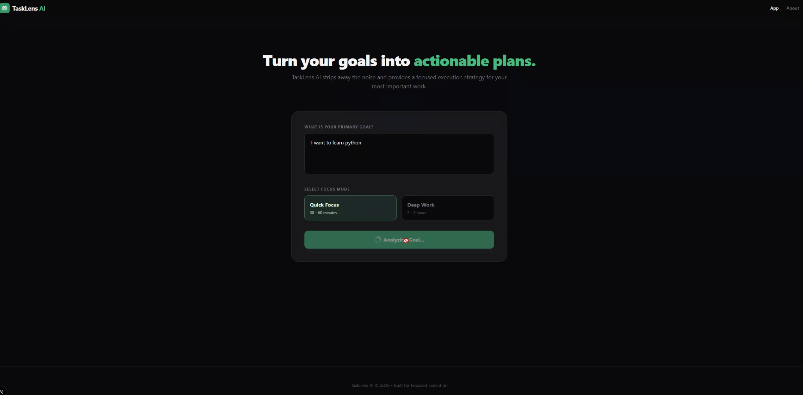

# TaskLens AI MVP

Turn vague goals into focused, time‑boxed execution plans using a **local** LLM. No paid APIs, no cloud dependency.

## 🖼️ Screenshots




## 🎯 Why this exists

Vague goals create hesitation. TaskLens AI forces clarity by translating a single sentence into a practical plan: **summary**, **next action**, **ordered steps**, and **time blocks**.

## ✨ Highlights

- Natural‑language goal input
- Quick Focus (30–60 min) and Deep Work (2–3 hours) modes
- AI‑generated steps, immediate next action, and time blocks
- Fully offline local AI setup

## 🧭 Demo Flow

1. Enter your primary goal.
2. Choose focus mode.
3. Generate a plan and act on the immediate next step.

## 🧰 Tech Stack

- **Next.js (App Router)** for UI and API route
- **TypeScript** for type safety
- **llama.cpp** local server for LLM inference

## 🧩 Architecture

Browser → Next.js UI → `/api/plan` → local llama.cpp server → model

## 🚀 Quick Start

```bash
git clone https://github.com/your-username/tasklens-ai.git
cd tasklens-ai
copy .env .env.local
npm install
npm run dev
```

App runs at: http://localhost:3000

## ⚙️ Environment

`AI_API_URL` is required. Copy `.env` → `.env.local` and update as needed.

## 🤖 Local AI Setup (Required)

1. Download llama.cpp: https://github.com/ggerganov/llama.cpp/releases
2. Download a GGUF model (recommended):
   `mistral-7b-instruct-v0.2.Q4_K_M.gguf`
3. Start server:

```bash
./llama-server.exe -m path/to/model.gguf --port 8080 --ctx-size 4096
```

4. Verify: http://127.0.0.1:8080

## 📦 API Contract (Expected AI JSON)

The API expects the model to return **valid JSON only** in this format:

```json
{
  "summary": "string",
  "immediateNextAction": "string",
  "steps": ["string"],
  "timeBlocks": [{ "duration": "string", "activity": "string" }]
}
```

## 🗂️ Project Structure (Key Files)

- UI entry: `app/page.tsx`
- Plan rendering: `app/components/PlanDisplay.tsx`
- API route: `app/api/plan/route.ts`
- Types: `app/types.ts`
